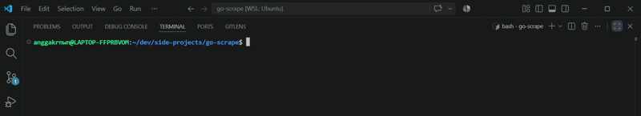
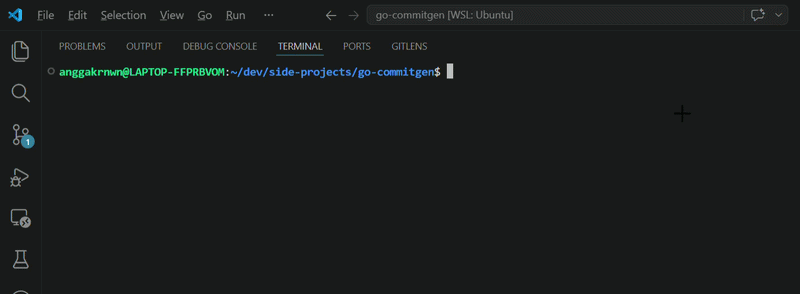

#  Go CommitGen


Sebuah alat CLI berbasis Go untuk menghasilkan pesan *Conventional Commits* secara otomatis. Ditenagai oleh Model LLM untuk menganalisis perubahan kode secara akurat dan instan.

---

## Fitur Utama
- **Automated Diff Analysis**: Otomatis membaca *staged changes* dari repositori lokal.
- **AI-Powered**: Menggunakan Model LLM untuk memahami konteks perubahan kode.
- **Structured Output**: Menjamin respons AI selalu dalam format JSON (Tipe, Scope, Deskripsi, dan Body).
- **Standardized**: Menghasilkan pesan commit yang rapi sesuai standar industri (*Conventional Commits*).

## Demo

### Mode Prod (`gcm`)
<p align="center">
  
</p>

### Mode Dev (`go run`)
<p align="center">
  
</p>

## Prasyarat
- **Go 1.25**.
- **Model LLM**

## Instalasi & Penggunaan

### 1. Instalasi
```bash
git clone https://github.com
cd go-commitgen
go mod tidy
```

### 2. Konfigurasi
Salin berkas contoh environment dan sesuaikan isinya:
```bash
cp .env.example .env
```
Lalu isi `.env` dengan API Key:
```env
GEMINIAPIKEY=your_gemini_api_key
OPENAPIKEY=your_openai_api_key
DEFAULTMODEL=your_model_name  
```

### 3. Penggunaan
Lakukan perubahan pada kode, *stage* file tersebut, lalu jalankan aplikasinya:
```bash
git add .
go run cmd/gcm/main.go
```

## Arsitektur

Proyek ini memisahkan *concerns* secara ketat untuk menjaga kode tetap modular dan mudah dikembangkan:

```text
go-commitgen/
├── assets/                  # Aset statis untuk dokumentasi
├── cmd/
│   └── gcm/                 # Entry point aplikasi (main.go)
├── internal/
│   ├── domain/              # Definisi entitas dan abstraksi interface
│   ├── usecase/             # Logika bisnis utama (orkestrasi LLM & Git)
│   ├── repository/          # Implementasi adapter (Git reader & LLM client)
│   └── infrastructure/      # Konfigurasi eksternal (API, Environment)
├── .env                     # File konfigurasi environment
├── .env.example             # Contoh konfigurasi (template untuk pengguna)
├── go.mod
└── go.sum
```

---
 Happy Coding! 🚀
